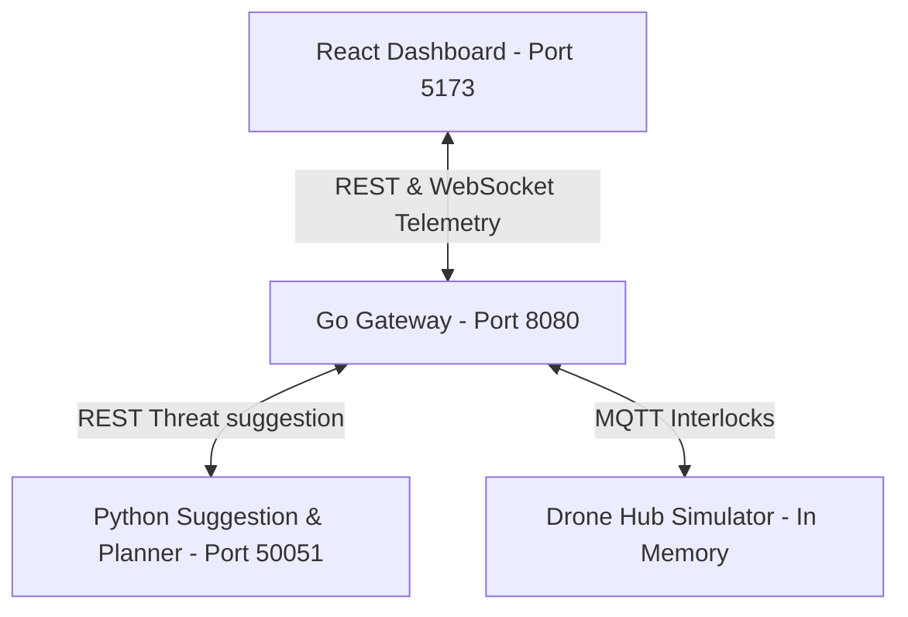

# USS Surveillance Dashboard — Execution Guide

This document describes how to run and test all components of the USS Surveillance Dashboard project locally.

---

## System Architecture Overview

The system consists of three main decoupled services that run concurrently:



---

## Prerequisites

Before launching the application, ensure you have the following runtimes installed:
* **Go** (version 1.22+ or newer)
* **Node.js** (version 18+ with `npm` package manager)
* **Python** (version 3.8+ or newer)

---

## Step-by-Step Launch Guide

To run the full stack, open three separate terminal tabs and launch the services in order:

### 1. Start the Suggestion & Planner Engine (Python)
The suggestion engine computes geofence threat assessments and lawnmower flight path coordinates.
```bash
cd suggestion-engine
python3 main.py
```
* **Status Indicator:** You should see `Suggestion & Planner Engine listening on port 50051...`.

---

### 2. Start the Gateway Backend (Go)
The Go Gateway handles operator controls, mutual exclusion leases, telemetry WebSockets, and database persistent logging.
```bash
cd backend
go run cmd/gateway/main.go
```
* **Status Indicator:** You should see `Initializing USS Surveillance Gateway...` followed by JWT configuration warnings if running with default OIDC dev overrides. The gateway binds to port `8080`.

---

### 3. Start the Dashboard UI (React)
The frontend dashboard provides a midnight ocean theme operator control desk with dynamic Leaflet maps, WebRTC canvas HUD, and timeline scrubbers.
```bash
cd frontend
npm install
npm run dev
```
* **Access Link:** Open your browser and navigate to **[http://localhost:5173](http://localhost:5173)**.

---

## Simulating a Mission Flow (How to Test)

1. **Sign In:** Use the default developer bypass accounts to sign in as an **operator**.
2. **Draw Patrol Area:** Click **Draw Area** on the map, draw a closed polygon, and see the centroid threat analysis.
3. **Confirm Mission:** Click **Confirm Mission** to trigger the takeoff safety checks stepper.
4. **Active Flight:** Watch the drone marker advance step-by-step along the path while telemetry updates at 1 Hz.
5. **Autoland & Charge:** Once the final coordinate is reached, watch the hub cover transition (`opening` ➔ `open` ➔ `closing` ➔ `recharging`) and replenish battery charge to 100%.
6. **Timeline Replay:** Click the **History** tab in the left sidebar, select a completed mission, and drag the timeline slider to scrub playback coordinates.
