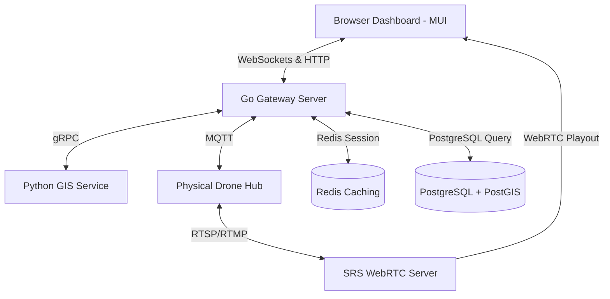

# Architecture Spine: USS Surveillance

## Design Paradigm
We adopt an **Event-Driven Service-Oriented Architecture (SOA)**:
- **Go Telemetry Gateway:** Handles real-time high-throughput state updates, WebSockets streaming to browsers, and command-and-control overrides.
- **Python GIS Service:** Handles geometry-heavy calculations (Drone Suggestion Engine and Flight Path Generator).
- **Communication Channels:** WebSockets for client browser telemetry, MQTT for drone telemetry ingest, and gRPC for Go/Python inter-service calls.



## Invariants & Rules

### AD-1 — On-Premises Host Constraint
- **Binds:** Deployment environments
- **Prevents:** Cloud provider lock-in and security compliance failures for local facility security.
- **Rule:** [ADOPTED] The platform must deploy on local physical server infrastructure within the organization's private local area network (LAN). No runtime features (aside from optional weather APIs) may depend on public cloud access.

### AD-2 — Go-Python Language Boundary
- **Binds:** System backend services
- **Prevents:** Monolithic bloat and language mismatch (putting GIS geometry in Go or high-concurrency loops in Python).
- **Rule:** [ADOPTED] Go governs HTTP routing, WebSockets execution, active drone command dispatch, and PostgreSQL/Redis interactions. Python governs flight path grid optimization, suggestion logic, and multi-criteria asset filtering.

### AD-3 — WebRTC Transcoding Gateway
- **Binds:** Video ingest and playout
- **Prevents:** Video latency exceeding the 500ms real-time operator reaction budget.
- **Rule:** [ADOPTED] Live video feeds must utilize WebRTC playout to the client browser. Video transcoding from drone RTSP/RTMP payloads must be handled by an on-premises SRS (Simple Realtime Server) instance.

### AD-4 — GIS Data Storage Separator
- **Binds:** Storage components
- **Prevents:** Heavy database I/O degradation from 1 Hz telemetry writes.
- **Rule:** [ADOPTED] Real-time active drone telemetry must only update in-memory inside Redis. Relational data (user permissions, drone hub stats, completed mission flight logs, and geofence polygons) must reside in PostgreSQL, with spatial data utilizing the PostGIS extension.

### AD-5 — Single-Operator command Mutex
- **Binds:** FR-11 (Manual Override Controls)
- **Prevents:** Split-brain conflicts where multiple operators issue contradictory override signals (Pause, RTH, Land) to a flying drone.
- **Rule:** [ADOPTED] An active drone flight requires an exclusive operator write-lock lease in Redis. Only the operator holding the lease can send command overrides; other users are forced into viewer-only mode. If the operator's heartbeat WebSocket ping fails for >10 seconds, the Go gateway must auto-issue a Pause command to the drone and release the lease.

### AD-6 — Go Gateway Geofence Validation
- **Binds:** FR-8 (Terrain & Obstacle Clearance), FR-12 (takeoff sequences)
- **Prevents:** Collisions or regulatory violations caused by incorrect calculations in the Python path planner.
- **Rule:** [ADOPTED] The Go gateway must run a PostGIS intersection query checking the calculated Flight Plan waypoints against the restricted airspace polygon database before uploading any route parameters to a Drone Hub. All coordinate geometry values serialized in REST/gRPC payloads must use standard EPSG:4326 with exactly 7 decimal places of precision to avoid spatial drift between services.

### AD-7 — Paired Replay Archive format
- **Binds:** FR-17 (Synced Data Archival)
- **Prevents:** Time-drift mismatch between video playback and map markers during post-mission reviews.
- **Rule:** [ADOPTED] Completed missions must be archived as two companion artifacts: a standard MP4 video file and a JSON telemetry coordinate log containing lat/lng/alt values stamped in milliseconds relative to the takeoff start (`t=0`).

### AD-8 — JWT role validation
- **Binds:** FR-16 (Role-Based Access Control)
- **Prevents:** Unauthorized command injection or camera feed access by unprivileged users.
- **Rule:** [ADOPTED] All HTTP REST request headers and WebSockets connection upgrade requests must validate a signed JWT token containing OIDC-issued user roles (`viewer`, `operator`, `admin`).

## Consistency Conventions

| Concern | Convention |
| --- | --- |
| Naming | Snake-case for database columns, camelCase for API JSON payloads, PascalCase for Go structs. |
| Telemetry Schema | Telemetry messages must adhere to the unified event shape: `{ "droneId": string, "timestamp": int64, "lat": float64, "lng": float64, "alt": float32, "battery": int, "speed": float32 }`. |
| Error Envelopes | All HTTP errors must return: `{ "code": string, "message": string, "details": [] }`. |

## Stack

| Name | Version |
| --- | --- |
| Go | 1.22+ |
| Python | 3.11+ |
| PostgreSQL | 16+ (PostGIS 3.4+) |
| Redis | 7.2+ |
| SRS (Simple Realtime Server) | 6.0+ (WebRTC enabled) |
| Mosquitto MQTT Broker | 2.0+ (SSL Enabled) |

## Structural Seed

```text
{root}/
  services/
    gateway/       # Go gateway source, API routes, MQTT subscriber, WebSockets handler
    planner/       # Python path planner, Suggestion Engine, GIS helpers
  docker-compose.yml # Local deployment orchestrator
```

## Deferred
1.  **Drone Hub API Version:** The specific model-version wrapper for the DJI Dock MQTT API structure (deferred until physical hardware is locked).
2.  **Hardware Server Brand:** Pinned server provider (Dell PowerEdge vs. HP ProLiant) for on-premises hosting.
