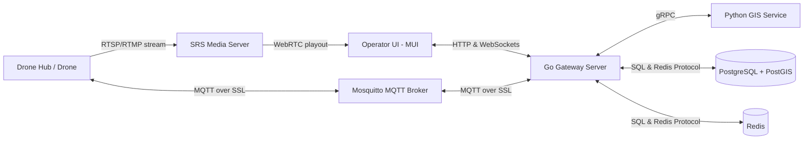

# High-Level Design (HLD): USS Surveillance

This document describes the high-level system components, data flows, and communication protocols for the USS Surveillance platform, providing stakeholders and engineers with a conceptual map of the architecture.

## 1. System Component Boundaries
The platform is deployed fully on-premises and divided into five primary logical blocks:

1.  **Client Dashboard (Frontend):** A single-page web app built on React/Material UI, displaying the 2D map (Leaflet/MapLibre), the 3D elevation viewer, active telemetry readouts, live WebRTC video, and mission logs.
2.  **Go Gateway Server (Backend Core):** The central hub that manages client API routes, routes WebSocket telemetry, processes user commands, validates JWT SSO permissions, checks geofences against PostGIS, and interacts with Redis and PostgreSQL.
3.  **Python GIS Service (GIS Engine):** A dedicated service running path-planning algorithms (grid-patrol optimization) and fleet allocation suggestions.
4.  **SRS (Simple Realtime Server):** The media gateway that ingests incoming RTSP or RTMP feeds from the physical drone camera and transcodes them on-the-fly to ultra-low-latency WebRTC streams.
5.  **Mosquitto MQTT Broker:** The secure communication broker facilitating telemetry and command exchanges with physical Drone Hubs.

---

## 2. Key Data Flows

### 2.1 Real-Time Telemetry Flow (1 Hz)
Used to keep Sarah's map and dashboard metrics updated.
1.  **Ingestion:** The flying Drone streams its status parameters (coordinates, battery, speed) to the **MQTT Broker** under the topic `drones/{droneId}/telemetry`.
2.  **Processing:** The **Go Gateway** (listening to MQTT) receives the packet, validates the payload structure, and writes the latest coordinates to **Redis** (updating the `drone:{droneId}:telemetry` key).
3.  **Distribution:** The Go Gateway broadcasts the telemetry update via **WebSockets** to all active operator browsers currently monitoring that drone.

### 2.2 Command Override Flow (<200ms latency)
Dispatched when Sarah clicks "Pause", "RTH", or "Land".
1.  **Request:** Sarah clicks the button. The browser transmits the command packet via the active **WebSocket connection** to the **Go Gateway**.
2.  **Authorization:** The Go Gateway verifies Sarah's JWT session role and checks in **Redis** if she holds the active operator lock lease for this drone.
3.  **Dispatch:** If authorized, the Go Gateway immediately publishes the control packet to the **MQTT Broker** under `drones/{droneId}/commands`.
4.  **Execution:** The physical **Drone Hub** receives the command and executes the maneuver (e.g. initiating immediate descent or hovering).

### 2.3 WebRTC Video Streaming Flow
Delivers the low-latency visual feed.
1.  **Video Ingestion:** The physical Drone Hub streams the active drone payload feed to the **SRS Media Server** using standard RTSP or RTMP over the local network.
2.  **Transcoding:** SRS transcodes the incoming feed into WebRTC packets in real-time.
3.  **Delivery:** The operator's browser establishes a WebRTC connection directly to the SRS server and plays the live video feed.

### 2.4 Mission Replay Synchronization Flow
1.  **Archival:** When the drone lands, the Go Gateway compiles the 1 Hz telemetry log from Redis into a single `.json` coordinate array, saves it to PostgreSQL, and pulls the recorded `.mp4` video from SRS to local storage.
2.  **Replay Mode Request:** When Sarah selects a past mission, the browser requests the logs via HTTP. The Go Gateway serves the `.mp4` video file and the `.json` coordinate timeline.
3.  **Synchronized Scrubbing:** The browser UI locks the video player timeline to the `.json` array indices. As Sarah scrubs the slider, the video seeks to the frame and the map marker jumps to the GPS coordinates recorded at that exact millisecond.
